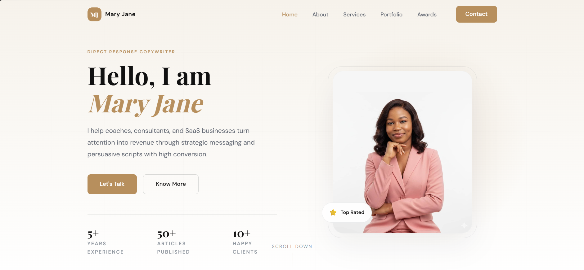

# Mary Jane Miracle Portfolio

A polished one-page portfolio website for Mary Jane Miracle, built with React and Vite. The site highlights her copywriting services, featured work, client recommendations, and contact options in a modern, responsive layout.



## Highlights

- Responsive one-page portfolio experience
- Sections for hero, about, services, recent work, testimonials, and contact
- Accessible navigation and form experience
- Optimized for desktop and mobile viewing
- Built with React, Vite, and modern CSS

## Tech Stack

- React 19
- Vite 8
- CSS Modules-style component styling
- Oxlint for linting

## Getting Started

1. Install dependencies
   ```bash
   npm install
   ```
2. Start the development server
   ```bash
   npm run dev
   ```
3. Build for production
   ```bash
   npm run build
   ```

## Project Structure

- src/components - Page sections and UI components
- src/index.css - Global styles and design tokens
- public - Static assets including the preview image and portfolio images

## Deployment

The project is ready to be deployed to any static hosting platform such as Vercel, Netlify, or GitHub Pages.

